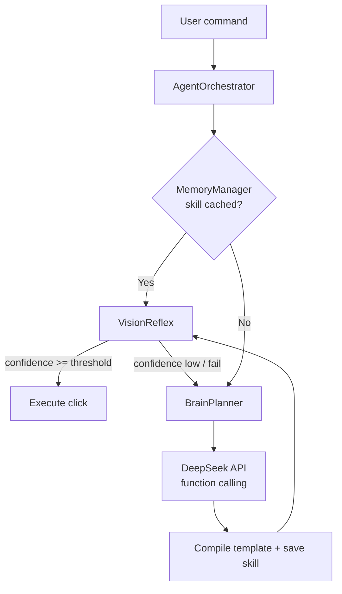

# Furti AI

Desktop automation agent that removes the latency and token-cost bottlenecks of
standard vision-language-action (VLA) agents by **compiling LLM plans into
local reflexes**.

Instead of calling the model on every frame, Furti AI calls it exactly once per
novel task. The resulting plan is "compiled" into a cropped template image +
metadata, cached locally, and replayed by OpenCV in milliseconds.

## Architecture



| Module | Responsibility |
| --- | --- |
| `AgentOrchestrator` | Main loop; routes Memory -> VisionReflex, owns the fallback |
| `MemoryManager` | RAG/cache layer; stores template paths + metadata as JSON |
| `VisionReflex` | OpenCV template matching + input execution, strict threshold |
| `BrainPlanner` | DeepSeek fallback; compiles plans into new reflexes |
| `ScreenCapture` / `InputController` | Swappable capture and mouse/keyboard backends |
| `Settings` | Paths, thresholds, and model endpoint |

## Install

```powershell
python -m venv .venv
.venv\Scripts\Activate.ps1
pip install -r requirements.txt
```

## Run the offline demo

The demo uses a synthetic screen and a mock LLM, so it performs **zero real
clicks** and needs **no API key**:

```powershell
python -m furti_ai
```

It walks through three phases:

1. **Novel task** — no cached skill, so the planner compiles a reflex.
2. **Cached task** — the reflex replays with zero LLM calls.
3. **UI changed** — the cached reflex fails, triggering the planner fallback
   and a successful retry.

## Real usage

```powershell
$env:DEEPSEEK_API_KEY = "sk-..."
```

```python
from furti_ai import build_agent

agent = build_agent()
agent.run("Click the Export button")
```

> **Vision note:** the task pipeline defaults to the OpenAI-compatible
> `deepseek-flash` model when DeepSeek is selected. It sends screenshots using
> the `image_url` chat payload when the visual gate decides that pixels are
> needed. You can point `DEEPSEEK_BASE_URL` / `DEEPSEEK_MODEL` at another
> vision-capable endpoint if required.

## Multi-step task pipeline (new)

The `TaskAgent` pipeline plans a whole instruction into **ordered steps**
(escalating to a smarter model when needed), shows the plan, and waits for
**console confirmation** before executing anything:

```powershell
$env:DEEPSEEK_API_KEY = "..."        # auto selects DeepSeek-flash when available
# Or force the image-capable DeepSeek path:
$env:FURTI_LLM_PROVIDER = "deepseek"
$env:DEEPSEEK_MODEL = "deepseek-flash"
# Or use Gemini explicitly:
# $env:FURTI_LLM_PROVIDER = "gemini"
pip install -r requirements-ocr.txt  # optional: PaddleOCR text grounding

python -m furti_ai --task "Open Notepad, write 'hello', and save the file"
```

While running:

- every **thought / step / action** is printed as
  `[HH:MM:SS] [KIND] message` and mirrored on an **always-on-top Tk status
  window** (task, phase, step, last log lines, token count),
- each input action immediately emits a `CONFIRM` event after the controller
  returns successfully; set `FURTI_VERIFY_STEPS=true` when you also want the
  model to verify the visible UI effect,
- the always-on-top status window shows the last screenshot timestamp and age,
  the latest raw AI response, and a highlighted current-action signal
  (`SEARCHING`, `ACTING`, `CONFIRMED`, `WAITING FOR AI`, or `ERROR`),
- if a step cannot be completed, the agent first retries/re-anchors it and
  then asks the model for a different route for the unfinished steps; it
  never repeats an unchanged failed route indefinitely,
- `THOUGHT`, `WAIT`, and response events show whether the AI is reasoning or
  waiting on a model response; there is no fixed sleep between successful
  steps,
- the cursor **moves smoothly** to targets by default
  (`FURTI_CURSOR_TELEPORT=true` restores instant jumps),
- the screen is grounded with **PaddleOCR text + saved-template icon
  matching** first, and the LLM itself decides when a raw screenshot is
  actually worth the tokens (capped at 1 capture/second); English OCR uses
  PaddleOCR's mobile models at reduced resolution and restores boxes to the
  full capture,
- screenshot coordinates, model-image coordinates, and Windows DPI-scaled
  PyAutoGUI coordinates are normalized separately; action logs show both the
  capture-space and input-space click point,
- `<ctrl>+<alt>+k` (or the window's STOP button) **aborts safely**,
- afterwards a **`<task_name>.md` report** (plan, step results, compiled
  reflexes, full log, tokens and approximate USD cost) is written to
  `~/.furti_ai/reports/`.

Read [docs/TECHNICAL_APPROACH.md](docs/TECHNICAL_APPROACH.md) for the full
architecture, the feature registry, the loop guardrails and the cost model.

### Environment variables

| Variable | Purpose | Default |
| --- | --- | --- |
| `DEEPSEEK_API_KEY` | API key for the reasoning endpoint | (none) |
| `DEEPSEEK_BASE_URL` | OpenAI-compatible base URL | `https://api.deepseek.com` |
| `DEEPSEEK_MODEL` | OpenAI-compatible DeepSeek model | `deepseek-flash` |
| `GOOGLE_API_KEY` | Google Gemini key (used when selected or when DeepSeek is unavailable) | (none) |
| `FURTI_LLM_PROVIDER` | `auto`, `deepseek`, or `gemini` | `auto` |
| `FURTI_WORKSPACE` | Where skills/templates/memory live | `~/.furti_ai` |
| `FURTI_FAST_MODEL` / `FURTI_SMART_MODEL` | Tiered models for the task pipeline | provider default |
| `FURTI_KILL_HOTKEY` | Global abort hotkey | `<ctrl>+<alt>+k` |
| `FURTI_INPUT_PAUSE` | Pause after each low-level PyAutoGUI call | `0.03` s |
| `FURTI_TYPING_INTERVAL` | Delay between typed characters for Windows event handling | `0.02` s |
| `FURTI_CURSOR_MOVE_DURATION` | Maximum smooth cursor travel duration | `0.25` s |
| `FURTI_VERIFY_STEPS` | Optional LLM check of the visible UI effect (dispatch confirmation is always on) | `false` |
| `FURTI_MAX_LLM_CALLS` | Per-task LLM call budget | `30` |
| `FURTI_MAX_PLAN_REPLANS` | Maximum adaptive route replacements per task | `3` |
| `FURTI_STATUS_WINDOW` | Disable the Tk overlay (`false`) | `true` |
| `FURTI_OCR_ENABLED` | PaddleOCR text grounding | `true` |
| `FURTI_OCR_MAX_DIM` | Maximum image dimension used by OCR (coordinates are restored to the full capture) | `960` |
| `FURTI_OCR_MKLDNN` | Enable PaddlePaddle oneDNN CPU acceleration | `false` |

## Extending

- **YOLOv8** — replace `VisionReflex._match` with a detector dispatch; the
  `execute()` interface is unchanged.
- **pynput** — write a second `InputController` implementation.
- **chromadb** — replace `MemoryManager`'s JSON backend for semantic recall;
  callers only use `get_skill` / `save_skill` / `normalize_name`.
